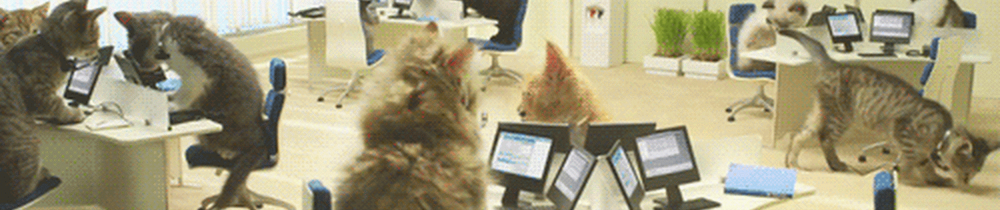

  

## Welcome to my GitHub! 👋
Thanks for stopping by my profile, I'm Ayan (pronounced i-on)! I'm currently a **third-year computer science undergraduate** at the **University of Virginia**, double minoring in **Data Science & English**. My interests involve full-stack software development, visual design, and all things English!

## About Me 
Currently, I'm a **full-stack developer** for UVA's theCourseForum, where I develop and maintain new features (using Python, HTML, CSS, Django, jQuery, Bootstrap, and Figma), contribute to bug fixing, and site redesign initiatives. I have also interned as an Education Technology Intern for mEducation Alliance, where I help support the creation of digital content initiatives while conducting research on the field of EdTech. 

I'm extremely passionate about centering accessibility within my work. Through my work with non profits, accessbility focused hackathons, and volunteer experience, I strive to center my technical experience to create tools and solutions that lower barriers to technology use and empower all, _regardless of background or circumstance!_

## Tech stack
Python, Java, HTML, CSS, OCaml, C, Assembly, JavaScript, Typescript, SQL, LaTeX, FXML, React, Vite, Framer, Tailwind, NumPy, Pandas, Django, jQuery, Bootstrap, Flask, Figma, Adobe Creative Suite, Microsoft Office, Bash, OpenCV, MediaPipe

## How to reach me:

Reach out to me on Linkedin right [here](https://www.linkedin.com/in/ayanrasulova/), and check out my DevPost right [here](https://devpost.com/ayanrasulova?ref_content=user-portfolio&ref_feature=portfolio&ref_medium=global-nav). You can also shoot me an email at **ayanfairfax@gmail.com**

## Check out my projects! 👇 

I have my personal website pinned (currently a work in progress, but will be deployed soon!), as well as some personal projects such as Thistle, PosturePal, ArTailor, and a keystrokes logger. You can also checkout the repo for theCourseForum website!

<!--
**ayanrasulova/ayanrasulova** is a ✨ _special_ ✨ repository because its `README.md` (this file) appears on your GitHub profile.

Here are some ideas to get you started:

- 🔭 I’m currently working on ...
- 🌱 I’m currently learning ...
- 👯 I’m looking to collaborate on ...
- 🤔 I’m looking for help with ...
- 💬 Ask me about ...
- 📫 How to reach me: ...
- 😄 Pronouns: ...
- ⚡ Fun fact: ...
-->
