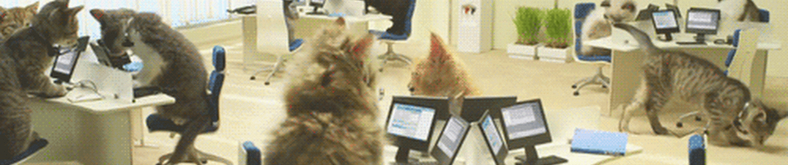

<!-- <p align="center">
  
</p> --> 

## hi, i'm ayan
```python

class Ayan:
    def __init__(self):
        self.education = {"University of Virginia" : "Third Year" }
        self.major = "Computer Science"
        self.minors = ["Data Science", "English"]

        self.tech_stack = ["Python", "Java", "HTML", "CSS", "OCaml", "C", "Assembly", "JavaScript", "Typescript", "SQL",
                            "LaTeX", "FXML", "React", "Vite", "Framer","Tailwind", "NumPy", "Pandas", "Django", "jQuery",
                            "Bootstrap", "Flask", "Figma", "Adobe Creative Suite", "Microsoft Office", "Bash", "Unix",
                            "OpenCV", "MediaPipe"]
        
    def about_me(self):
        print("My interests involve full-stack software development, visual design, and all things English!")
        print("I'm extremely passionate about centering accessibility within my work, including non profit internships,
              accessbility focused hackathons, and volunteer experience.")
        print("I strive to center my technical experience to create tools and solutions that lower barriers to technology
              use and empower all, regardless of background or circumstance!")

ion = Ayan()
ion.about_me()
```

Reach out to me on Linkedin right [here](https://www.linkedin.com/in/ayanrasulova/), and check out my DevPost right [here](https://devpost.com/ayanrasulova?ref_content=user-portfolio&ref_feature=portfolio&ref_medium=global-nav). You can also shoot me an email at **ayanfairfax@gmail.com**


<!--
**ayanrasulova/ayanrasulova** is a ✨ _special_ ✨ repository because its `README.md` (this file) appears on your GitHub profile.

Here are some ideas to get you started:

- 🔭 I’m currently working on ...
- 🌱 I’m currently learning ...
- 👯 I’m looking to collaborate on ...
- 🤔 I’m looking for help with ...
- 💬 Ask me about ...
- 📫 How to reach me: ...
- 😄 Pronouns: ...
- ⚡ Fun fact: ...
-->
